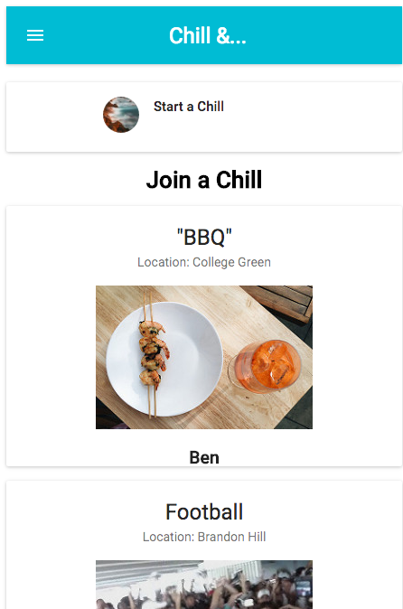
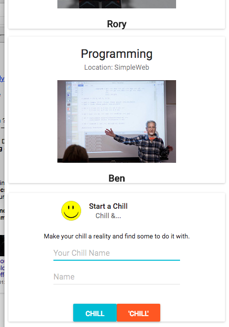

It's a nice sunny day, your mates are all busy and you want to find some likeminded people to chill and do something. How can you find them? This is where Chill& comes in; start a chill and specify what you're doing, others will be able to see your chills and join in and come chill with you.

Created for a SimpleWeb 3 hour hackathon.

## About

Our Team was made up of Ben Allen (@Ben_Allen), Rory Smith (@roarster31) and Simon Partridge (@Simonjpartridge).

The web app, Chill&, is aimed at people wanting to organise a social event but not having anyone to do it with. You simple enter what you want to do and where you want to do it such as 'Chill&Picnic' in 'Brandon Park'. Your Chill is then shown to nearby users who are free to join. When a user joins, they can optionally specify something they would like to bring such as 'music', thus changing the event name to Chill&Picnic&Music. Two types of Chills are available, the standard Chill or the slightly more involved 'Chill'. These allow people to gauge an understanding of what type of Netflix & Chill you are on about!

## Tech

Uses Material-UI, which is based on React.
Server side components use Node.js

##To Run
clone repository

run "npm install"

run "npm start"

## Screenshots

